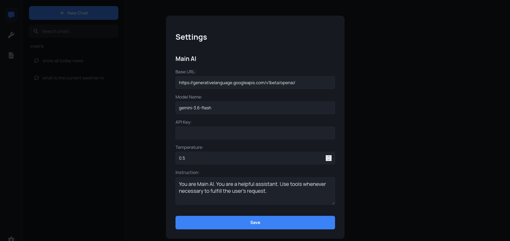

# slobrun
A personal AI that relies heavily on tools to help you easily automate tasks.

[](https://ortonsius.github.io/Portfolio/assets/slobrun.mp4)

## Motivation
I create this app that hopefully could help you get your job done faster. The idea of this app is came from Nocobase and OpenClaw. Nocobase is a low-code UI builder and OpenClaw is a autonomous personal AI assistant. When it combine together, we could have a personal AI assistant and low-code UI builder at same time.

## Features
- Normal conversation with AI (have tool calling capability)
- Generate python script as tool with AI
- Generate HTML as webpage with AI
- Run tool as HTTP API
- Open webpage

## Quick Start

1. Install required library
```
pip install -r requirements.txt
```

2. Run the app
```
python app.py
```

3. Open setting and configure your own AI API



## Final Note
This app is still far from perfect. Lot of things and features need to be added/change and I really appreciate if you have any positive feedback. Thx.
